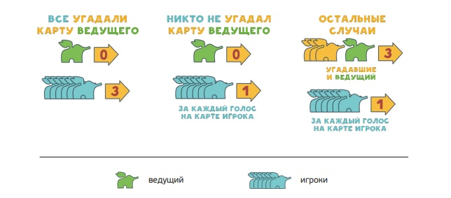

# Сценарий игры <!-- omit in toc -->

### 1
Ведущий загадывает ассоциацию. Для этого он выбирает одну из своих карт и пишет к ней ассоциацию.
Его цель — сделать так, чтобы его карту угадали, но при этом не все игроки.
В таком случае он получит больше всего очков.

### 2
Как только ведущий загадает ассоциацию, остальным игрокам
нужно выбрать среди своих карт наиболее подходящую под
ассоциацию и отправить. Их цель — сбить с толку остальных
игроков, когда будут голосовать, какая из карт принадлежит
ведущему.

### 3
Как только все игроки предложили свои карты, наступает голосование.
Цель: найти карту ведущего и выбрать её. Тогда вы получите 3 очка.

Если ведущего угадают все игроки, то он не получает очков в этом ходу. Совсем.
Если ведущего никто не угадает, он также не получает очки.

Есть бонусные очки, получаемые каждым игроком, включая ведущего. Сколько игроков проголосовало за карту,
столько очков дополнительно получает хозяин каждой карты, включая ведущего.

### 4
Когда начислены очки, и все ознакомились с текущим результатом игры, можно двигаться в следующий ход.
Игроки получают по одной новой карте. Ведущим становится новый игрок. 
